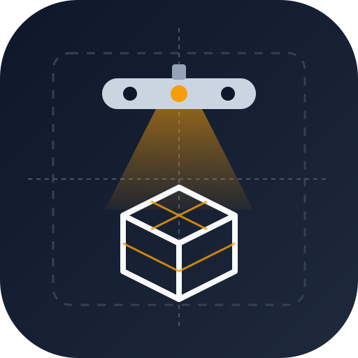

# kinect-forge

<p align="center"></p>

kinect-forge turns a Kinect v1 you already own into a 3D scanner on Ubuntu. Put a
small object on a turntable, capture depth and colour, and get back a clean mesh
with its dimensions and volume.

!!! tip "Sibling project: triaina"
    kinect-forge makes the model. [triaina](https://nikolareljin.github.io/triaina/)
    makes the object: it drives an ELEGOO Neptune 4 as an FDM printer or a
    drag-knife vinyl cutter. Scan a broken part here, export it, print it there.

| Step | What it does |
|---|---|
| [Capture](CAPTURE_WORKFLOW.md) | Records depth + RGB frames, with turntable presets and auto-stop |
| [Calibration](CALIBRATION.md) | Camera intrinsics; `calibration.json` is picked up automatically |
| [Reconstruction](RECONSTRUCTION.md) | Open3D TSDF integration, turntable ICP and loop closure into a mesh |
| Measure | Dimensions and volume of the reconstructed object |
| Export | GLB / OBJ / PLY / STL for slicers and viewers |
| [GUI](GUI.md) | Pipeline tab: Capture, Build Model, View in three steps |

## Why a Kinect?

- Rebuild broken parts from their exact dimensions.
- Fit checks and rapid prototyping without buying a scanner.
- Learn the capture -> reconstruct -> measure workflow on a budget.

## Quick start

```bash
./deps      # system packages
./setup     # development checkout: venv + package
source .venv/bin/activate
python -m kinect_forge --help
```

## Start here

1. [Setup](SETUP.md) and [Configuration](CONFIG.md)
2. [Calibration](CALIBRATION.md)
3. [Capture workflow](CAPTURE_WORKFLOW.md), then [Reconstruction](RECONSTRUCTION.md)
4. [GUI](GUI.md) for the guided pipeline
5. If something breaks: [Troubleshooting](TROUBLESHOOTING.md)
